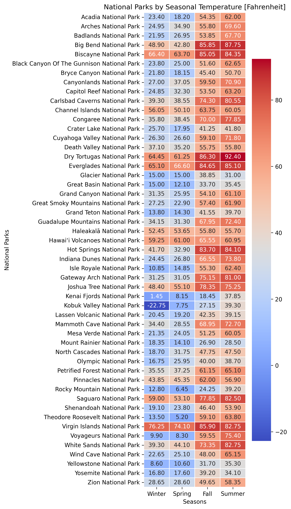

# Exploring the Great Outdoors: Weather and Activities Across US National Parks
Melisa Morales, Victoria Scott, and Stephanie Souza (Team Three)

# Wild Wonders: Unveiling US National Park Data

This project involves creating ETL (Extract, Transform, Load) workflows to ingest and transform data from the National Park Service (NPS) API and Open-Meteo Weather API before storing it in a database. A chosen database, MongoDB, houses the data, comprising at least two tables or collections. The project documentation includes the rationale for the database selection and detailed documentation of the ETL workflow, supported by diagrams or an ERD.

Our powerpoint presentation can be found at "NPS ETL Team Project 3.pptx"

## Chasing Sunshine: Finding the Perfect Weather for Your National Park Adventure

A heatmap plot of seasonal temperatures across US national parks can be an invaluable tool for both researchers and park visitors. By visually representing temperature variations throughout the year, the heatmap allows users to easily identify the best times to visit specific parks based on their weather preferences. For instance, those looking to avoid extreme heat can quickly pinpoint cooler seasons, while others seeking warmer conditions can identify peak times for their ideal weather. Additionally, this visualization can assist park management and conservationists in understanding climate patterns and their impact on park ecosystems, aiding in the development of strategies to protect and preserve these natural environments. Overall, a heatmap of seasonal temperatures serves as a comprehensive, user-friendly guide for making informed decisions about park visits and understanding broader climate trends.



## Park Pursuits: Exploring Activities, Amenities, and Weather

Our National Parks Finder app is a web-based application designed to help users discover national parks based on their desired amenities and activities. Built with a Flask backend and a MongoDB database, the app provides an interactive map that displays parks matching the user's preferences. Users can filter parks by selecting from a variety of amenities and activities, and choose the season they are interested in. The app dynamically updates the map to show relevant parks, providing detailed information about each one. This tool is perfect for planning trips and exploring the best that national parks have to offer.

### Technical Overview:

1. **Backend**: The backend is developed using Flask, a lightweight WSGI web application framework in Python. Flask provides the necessary routes and endpoints to handle user requests, filter parks based on user selections, and return the relevant data to the frontend.
   
2. **Database**: MongoDB is used to store the national park data. The database contains collections for park amenities, activities, and seasonal weather data. This non-relational database allows for flexible and scalable data storage, which is essential for handling the diverse and extensive data of national parks.

3. **Map Integration**: The app utilizes `folium` to create interactive maps. `folium` is a Python library that makes it easy to visualize geospatial data. The map displays markers for each park, which are clustered to improve visualization and user experience. Clicking on a marker reveals detailed information about the park, including its name, website, fees, and seasonal temperatures.

4. **User Interface**: The frontend is built using HTML, CSS, and JavaScript. Users can select amenities and activities from scrollable lists and choose their preferred season. The interface is designed to be user-friendly and responsive, ensuring a seamless experience across different devices.

### Key Features:

- **Interactive Map**: Displays national parks with markers that users can click to view detailed information.
- **Filter Options**: Users can filter parks by selecting amenities, activities, and preferred season.
- **Dynamic Updates**: The map updates in real-time based on the user's selections, ensuring relevant results are displayed.
- **Detailed Park Information**: Each park marker provides detailed information, including park name, website link, fees, and seasonal temperatures.

### How It Works:

1. **Data Loading**: The app fetches data from MongoDB, including park details, amenities, activities, and weather information.
2. **Map Creation**: Using `folium`, the app creates an interactive map with markers for each park.
3. **User Interaction**: Users select desired amenities, activities, and season on the frontend.
4. **Filtering**: The backend processes these selections, queries the MongoDB database, and filters the parks accordingly.
5. **Map Update**: The filtered results are sent back to the frontend, and the map is updated dynamically to display the relevant parks.

### Installation Instructions:

To run the National Parks Finder app locally, follow these steps:

1. **Clone the repository**: Clone the project repository to your local machine.
2. **Navigate to the project directory**: Open the integrated terminal in your code editor and navigate to the project directory.
3. **Install dependencies**: Run the following command to install the required Python packages:
    ```sh
    pip install -r requirements.txt
    ```
4. **Run the Flask application**: Start the Flask server by running:
    ```sh
    flask run
    ```
5. **Access the application**: Open a web browser and navigate to `http://127.0.0.1:5000` to access the National Parks Finder app.

By providing an easy-to-use interface and detailed information, the National Parks Finder app helps users plan their trips and explore the great outdoors more efficiently.


# Ethical Considerations

When extracting amenities, activities, and weather data for US national parks, significant efforts were made to ensure ethical considerations were addressed throughout the process. Team Three ensured data accuracy and integrity by cross-referencing information from multiple reliable sources to avoid the propagation of misinformation. Transparency was maintained by clearly documenting the data sources, transformation processes, and any limitations or biases inherent in the data. These steps were essential to ensure the ethical use of data, safeguarding the interests of both the data providers and the end users who rely on this information for planning their visits to national parks.

# References
## Dataset: 
National Park Service (API)
https://www.nps.gov/subjects/developer/api-documentation.htm

Open-Meteo Weather (API)
https://open-meteo.com/

## Team Gitlab
https://github.com/melmelmorales/ETL_Project
